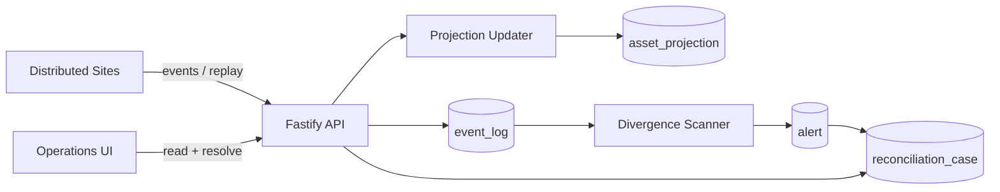
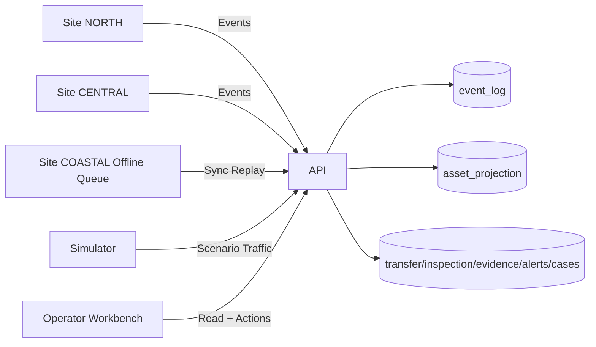
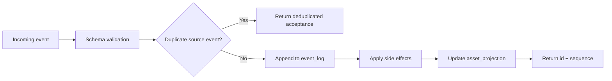
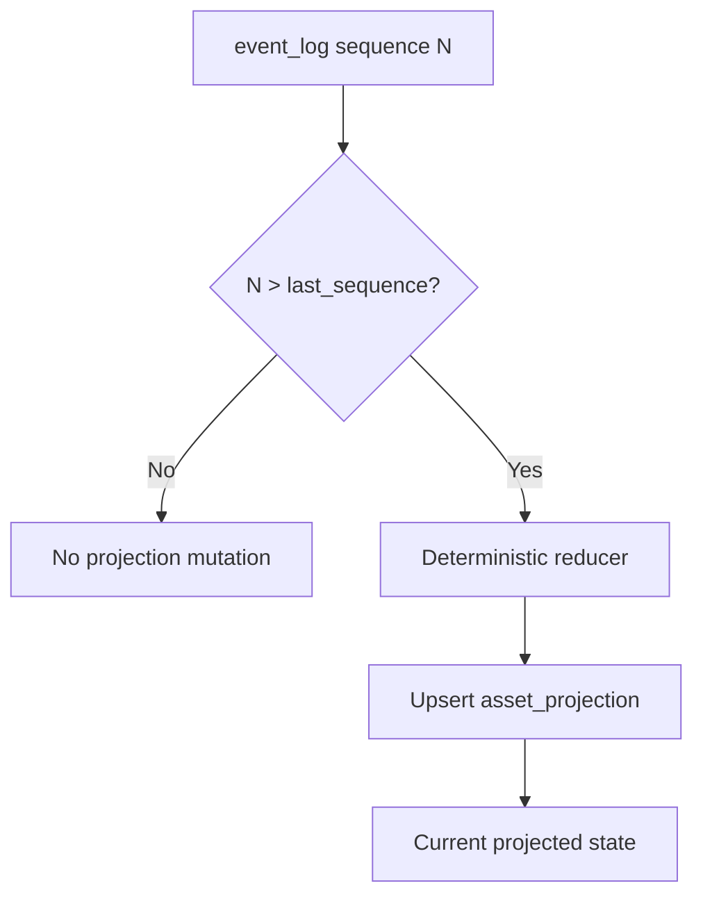
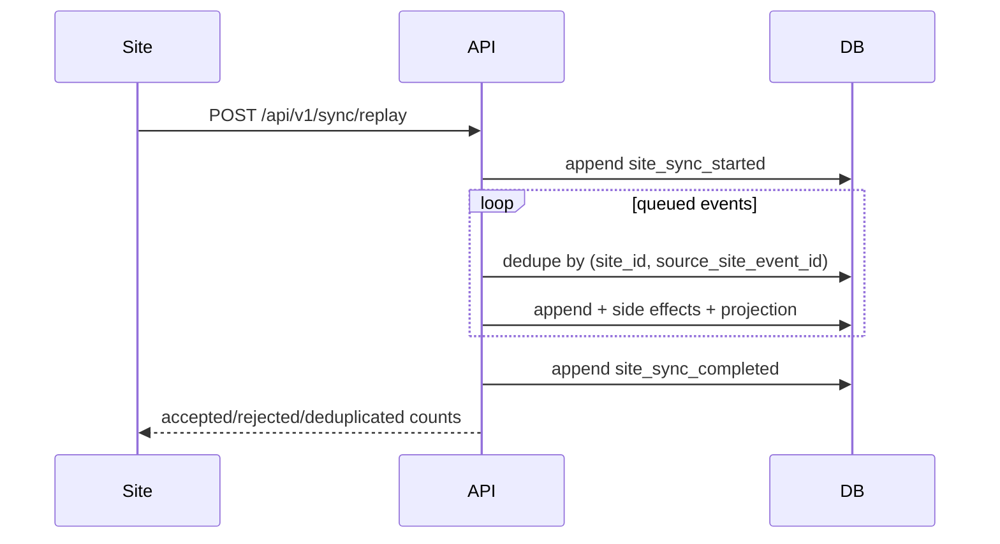
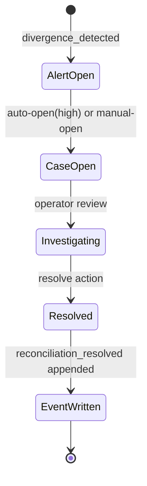

# Distributed Ops Control Platform

A distributed operations control system that models how real-world systems drift out of sync and how that drift is detected and reconciled.

This project demonstrates event-driven state, projection consistency, and operator workflows for resolving inconsistencies across distributed sites.

Clean-room, public-safe reference implementation of an internal operations platform for serialized assets.  
It is intentionally built to show distributed state integrity, replay behavior, and reconciliation controls beyond CRUD.

## Clean-Room Statement

This repository is original and public-safe.  
It intentionally avoids proprietary schemas, protected terminology, customer data, and confidential workflows.

## Start Here (5 Minutes)

1. Open `http://localhost:3000` and review dashboard status, policy thresholds, and simulation state.
2. Open an asset detail page to inspect projection state vs accepted event sequence.
3. Open a reconciliation case detail page to inspect source alert, linked entities, and resolution writeback.
4. Open a sync batch detail page to inspect accepted/rejected/deduplicated replay outcomes.
5. Open a transfer detail page to inspect lifecycle, overdue state, and linked event chain.
6. In any timeline table, click `Inspect` to view normalized event payload fields.

## Hero Detail Surface

The strongest single depth view is **Asset Projection Detail** (`/assets/:assetId`): it shows
current projected state, projection-vs-stream sequence alignment, accepted event chain, linked
transfers, linked reconciliation cases, and linked sync batches in one operator surface.

## Screenshots

Use these four repository-safe screenshot files (in this order):

- `docs/images/dashboard-view.png`
- `docs/images/asset-detail-view.png`
- `docs/images/reconciliation-case-detail-view.png`
- `docs/images/sync-batch-detail-view.png`

See [docs/images/README.md](docs/images/README.md) for capture guidance.

## Architecture At A Glance



## What This System Demonstrates

- Append-only operational ledger (`event_log`)
- Deterministic projection model (`asset_projection`)
- Idempotent replay (`site_id` + `source_site_event_id`)
- Sync batch outcomes with accepted/rejected/deduplicated behavior
- Divergence detection for transfer confirmation, conflicting observations, evidence gaps, stale sync, and projection lag
- Reconciliation as explicit operator workflow with event-backed resolution

## High-Value Test Signals

- replay idempotency behavior
- projection update correctness
- stale-site detection
- transfer confirmation overdue detection
- inspection evidence-gap detection
- reconciliation resolution event behavior

## Why This Is Not a CRUD App

- Append-only event stream is the system of record.
- Deterministic projections materialize current state.
- Replay and deduplication are explicit operational paths.
- Reconciliation is an operator control loop, not an afterthought.

## What Is Intentionally Simplified

- This is a deterministic simulator, not true distributed infrastructure.
- Evidence metadata is modeled; binary evidence storage is out of scope.
- Authorization and permissions are intentionally minimal.
- External integrations are omitted to keep event/replay behavior inspectable.

## Concrete Scenario Walkthrough

Seeded demo data creates a realistic mixed state:

1. 12 assets are registered across 3 sites (`NORTH`, `CENTRAL`, `COASTAL`).
2. 10 transfer orders are created; several complete, two remain unconfirmed past policy threshold.
3. Two assets are observed at multiple sites, creating conflicting observation alerts.
4. Multiple inspections are recorded; two intentionally have no evidence metadata.
5. One site replay batch is ingested with a duplicate source event to show idempotent acceptance.
6. One site remains stale beyond threshold.
7. One projection is intentionally set behind stream sequence to demonstrate projection integrity detection.
8. Divergence scan writes alerts and opens reconciliation cases for high-severity findings.

## Why Reconciliation Exists

Distributed systems drift because:

- Sites can operate offline and replay later.
- Transfer timing and confirmation timing diverge.
- Inspection evidence can be incomplete at initial record time.
- Projection updates can lag accepted events during transient failure states.

Reconciliation turns drift into explicit, owned, timestamped investigation and resolution work.

## Why `event_log` Does Not Foreign-Key Forward-Created Entities

`event_log` is the append-only source of truth.  
Some events reference entities that are created only after event acceptance:

- `asset_registered` creates `asset`
- `transfer_initiated` creates `transfer_order`
- `site_sync_started` creates `sync_batch`

If `event_log` enforced foreign keys on those forward-created entity IDs, valid events could not be ingested in correct causal order.

Therefore:

- `event_log.site_id` remains foreign-key constrained.
- `event_log.asset_id`, `event_log.transfer_order_id`, and `event_log.sync_batch_id` remain indexed but unconstrained.

This preserves causal ingestion order while retaining query performance and downstream integrity checks.

## Architecture Overview

### System Context



### Event Flow



### Projection Flow



### Sync / Replay Flow



### Reconciliation Lifecycle



## Domain Model Summary

- **Site**: operational node that emits events and sync batches
- **Asset**: serialized unit tracked across site custody
- **Transfer Order**: directed movement request between sites
- **Inspection / Evidence Metadata**: quality checks and linked proof metadata
- **Alert**: machine-generated divergence signal
- **Reconciliation Case**: operator-managed investigation and closure record

See [docs/domain-model.md](docs/domain-model.md) for schema details.

## Event Model Summary

Supported events:

- `asset_registered`
- `asset_moved`
- `asset_received`
- `inspection_recorded`
- `evidence_attached`
- `transfer_initiated`
- `transfer_completed`
- `site_sync_started`
- `site_sync_completed`
- `divergence_detected`
- `reconciliation_opened`
- `reconciliation_resolved`

See [docs/event-model.md](docs/event-model.md) for validation and replay behavior.

## Alert vs Case vs Projection vs Accepted Event

- **Accepted event**: immutable source-of-truth record in `event_log`
- **Projection**: derived current-state view for fast operational reads
- **Alert**: rule-based divergence detection output
- **Case**: operator-owned reconciliation task that can resolve an alert

## Monorepo Layout

- `apps/api` Fastify API + Drizzle + PostgreSQL migrations
- `apps/web` Next.js operator workbench
- `apps/simulator` deterministic replay/delay simulator
- `packages/contracts` shared typed contracts and Zod schemas
- `packages/domain` projection and divergence logic
- `packages/config` shared TypeScript config
- `packages/ui` shared UI helpers
- `docs` architecture, domain, event, sync, reconciliation, ADRs
- `scripts` bootstrap helpers

## Local Setup

Prerequisites:

- Docker + Docker Compose
- Node.js 20+

```bash
cp .env.example .env
docker compose up --build -d
docker compose exec api npm run db:migrate
docker compose exec api npm run seed
```

Endpoints:

- Web: `http://localhost:3000`
- API health: `http://localhost:4000/health`
- Versioned API health: `http://localhost:4000/api/v1/health`
- Dashboard API: `http://localhost:4000/api/v1/dashboard`

## Simulator

```bash
npm run start --workspace apps/simulator
```

The simulator pushes deterministic events, replays an offline queue, and runs divergence scan.

Scenario options:

- `SIM_SCENARIO=healthy-movement npm run start --workspace apps/simulator`
- `SIM_SCENARIO=sync-lag-divergence npm run start --workspace apps/simulator`

## Deep Review Path

1. Read [docs/architecture.md](docs/architecture.md) to understand event/projection/replay boundaries.
2. Inspect `apps/api/src/domain/event-service.ts` for ingestion, idempotency, and side effects.
3. Inspect `apps/api/src/domain/query-service.ts` for projection and operator-facing aggregation.
4. Inspect `packages/domain/src/projection.ts` and `packages/domain/src/divergence.ts` for deterministic domain logic.
5. Run seed and inspect UI detail pages (`assets`, `transfers`, `sync-batches`, `reconciliation`, `sites`).

## What To Inspect First (Hiring Manager Path)

1. `event_log` append-only model and replay handling
2. Projection consistency signals (projection sequence vs accepted stream sequence)
3. Divergence rules and resulting operator workflow
4. Reconciliation resolution writing back to event stream
5. Test coverage for idempotency and divergence detection

## Test Depth (Visible Proof)

Run:

```bash
npm test
npm run test:e2e
```

High-value tests include:

- replay idempotency behavior
- projection update correctness
- stale-site detection
- transfer confirmation overdue detection
- inspection evidence-gap detection
- reconciliation resolution event behavior

## Design Tradeoffs

- **Append-only ledger + derived projection** over mutable history rows:
  stronger auditability and replay semantics at the cost of additional query shaping.
- **Single relational database** over distributed infrastructure:
  keeps the reference implementation deterministic and inspectable while still modeling drift.
- **Explicit rule-based divergence detection** over opaque scoring:
  easier operator reasoning and safer public demonstration.
- **Operator-focused UI** over marketing-style dashboard:
  prioritizes investigation workflows, timelines, and state explanation.
- **Indexed but non-FK entity references in `event_log`** for forward-created entities:
  preserves causal ingest order while retaining efficient query paths for assets, transfers, and sync batches.

## Non-Goals

- Production auth/authorization and multi-tenant isolation
- Real evidence file storage integration
- Proprietary workflow replication
- Full distributed infrastructure orchestration

See [docs/non-goals-and-safety-boundaries.md](docs/non-goals-and-safety-boundaries.md).
