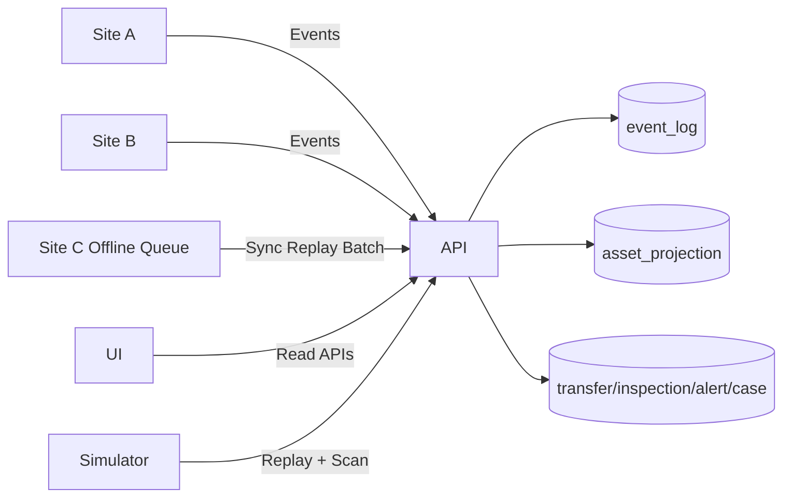
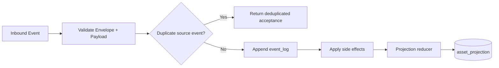
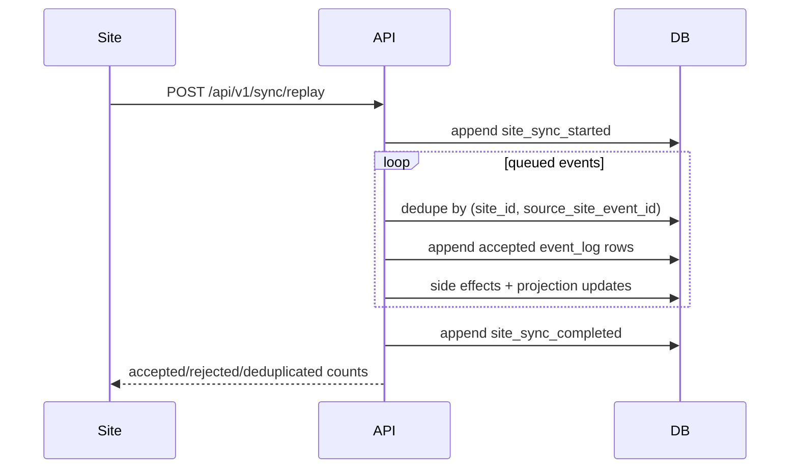
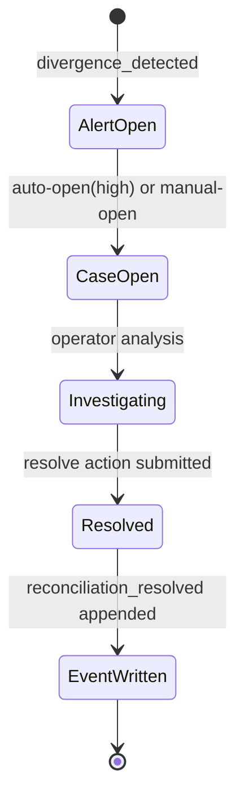

# Architecture

## System Context

The platform provides centralized operational control for serialized assets across multiple sites. Sites can operate independently for short periods, queue events when offline, and later replay events through sync batches.

## High-Level Components

- API (`apps/api`): event ingestion, projection updates, divergence scan, reconciliation workflows
- Database (PostgreSQL): source of truth and projections
- Workbench UI (`apps/web`): operator dashboard and investigation surfaces
- Simulator (`apps/simulator`): deterministic offline/online scenario runner

## Runtime Topology

## Event Ingestion and Projection Flow

## Sync Replay Flow

## Reconciliation Lifecycle

## Internal API Architecture

- Route layer: versioned endpoints and request validation
- Domain services: event ingestion, replay, divergence scanning, query aggregation
- DB layer: Drizzle schema + SQL migration management

## Key Flows

1. Event Ingestion:
- validate request against event-specific schema
- deduplicate by `(site_id, source_site_event_id)`
- append to `event_log`
- apply side effects (transfer, inspection, evidence, sync)
- update `asset_projection`

2. Sync Replay:
- emit `site_sync_started`
- replay queued events idempotently
- emit `site_sync_completed`
- update site sync timestamp and batch counts

3. Divergence Scan:
- evaluate generic divergence rules against operational tables
- create alerts for new findings
- auto-open reconciliation cases for high severity findings

## Operational Qualities

- append-only ledger for auditability
- deterministic projection updates
- idempotent replay using source event dedupe keys
- explicit rule-based divergence detection
- reconciliation workflow visibility

## Non-Goals

- Not a production authorization or tenancy model.
- Not a full distributed infrastructure deployment topology.
- Not a clone of any protected internal architecture.
