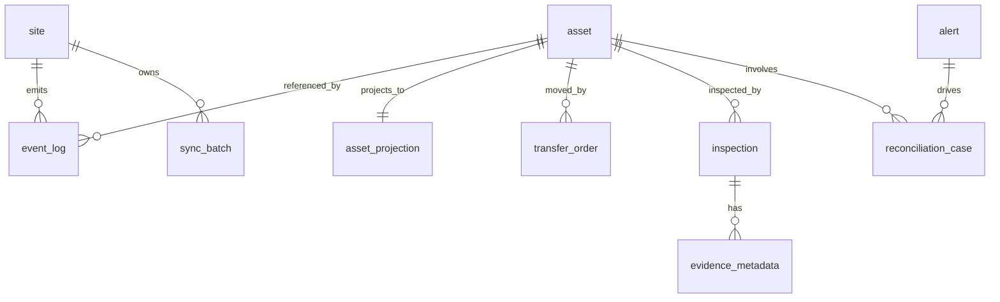

# Domain Model

## Core Entities

## Site

Represents an operational location that emits events and performs sync operations.

Key fields:

- `id`
- `code`
- `name`
- `last_sync_completed_at`

## Asset

Represents a serialized high-value asset tracked across sites.

Key fields:

- `id`
- `serial_number`
- `container_id`
- `registered_site_id`

## Event Log (`event_log`)

Append-only immutable stream of all accepted events.

`site_id` is foreign-key constrained. `asset_id`, `transfer_order_id`, and `sync_batch_id`
are intentionally non-FK references to support valid forward-created entities during ingestion.

Key fields:

- `id`
- `sequence_number`
- `event_type`
- `asset_id`
- `site_id`
- `transfer_order_id`
- `sync_batch_id`
- `source_site_event_id` (dedupe key part)
- `payload`

## Asset Projection (`asset_projection`)

Current-state materialized view derived from event replay.

Key fields:

- `asset_id`
- `current_site_id`
- `status`
- `last_event_type`
- `last_sequence`
- `version`

## Transfer Order

Represents directed asset movement between origin and destination sites.

## Inspection

Represents inspection observations performed at a site for an asset.

## Evidence Metadata

Stores evidence metadata references tied to inspections.

## Sync Batch

Represents a replay operation from an offline site queue.

## Alert

Represents an exception generated by divergence rules.

## Reconciliation Case

Human workflow record used to investigate and resolve alerts or manually reported exceptions.

## Relationship Sketch

## Non-Goals

- Not a full enterprise master-data model.
- Not a complete ERP or fulfillment schema.
- Not a proprietary schema mirror from prior systems.
