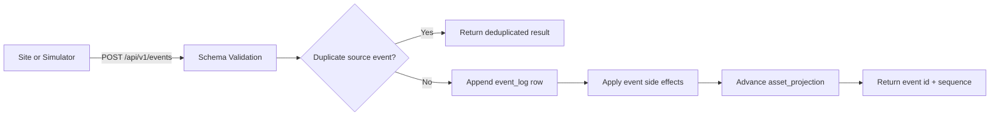
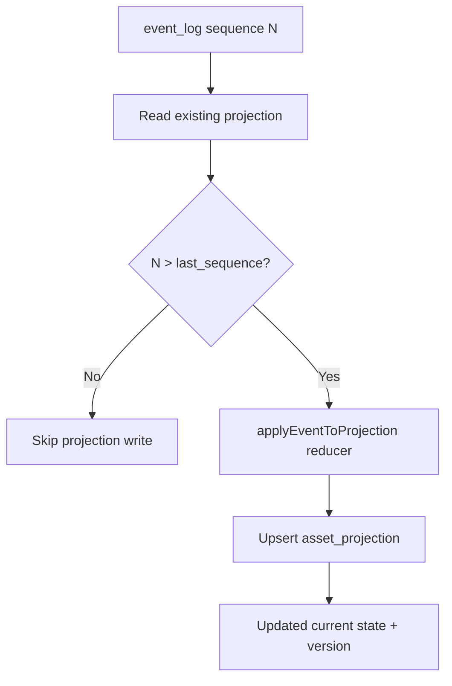

# Event Model

## Event Principles

- Event names are explicit, stable, and lowercase snake_case.
- Event log is append-only.
- Event handlers are deterministic.
- Replay is idempotent via dedupe keys and projection sequence checks.

## Supported Events

- `asset_registered`
- `asset_moved`
- `asset_received`
- `inspection_recorded`
- `evidence_attached`
- `transfer_initiated`
- `transfer_completed`
- `site_sync_started`
- `site_sync_completed`
- `divergence_detected`
- `reconciliation_opened`
- `reconciliation_resolved`

## Event Envelope

Each event includes:

- `eventType`
- `assetId` (nullable for system events)
- `siteId`
- `transferOrderId` (nullable)
- `occurredAt`
- `sourceSiteEventId` (used for idempotency)
- `payload` (validated by per-type schema)

## Event Flow Diagram

## Idempotency Model

1. During ingestion, if `sourceSiteEventId` is present, check existing `event_log` row with same `(site_id, source_site_event_id)`.
2. If found, return deduplicated result without appending.
3. Projection update only advances when incoming sequence exceeds stored `last_sequence`.

## Projection Update Model

`asset_projection` applies deterministic state transitions based on event type:

- register/receive/transfer completion => `at_site`
- movement/initiation => `in_transit`
- inspection => `under_inspection`
- divergence => `reconciliation_required`

## Projection Flow Diagram

## Handler Testability

Domain rule modules and projection reducers are isolated for unit tests under `packages/domain/src/*.test.ts`.

## Non-Goals

- Not a generalized workflow engine for arbitrary event types.
- Not exactly-once delivery infrastructure.
- Not a copy of any confidential event contract set.
