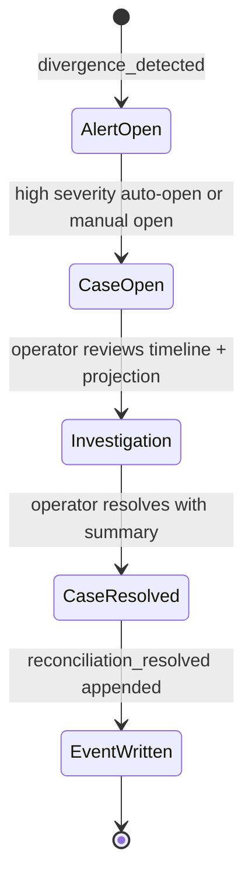

# Reconciliation

## Purpose

Reconciliation handles operational exceptions detected automatically or opened manually.

## Inputs

- divergence alerts from rule scanner
- operator-raised manual cases

## Divergence Rules

- `TRANSFER_NOT_CONFIRMED`: transfer remains in `initiated` status past `TRANSFER_CONFIRMATION_HOURS`.
- `ASSET_OBSERVED_AT_MULTIPLE_SITES`: latest observation stream shows an asset associated with more than one site.
- `INSPECTION_MISSING_EVIDENCE`: inspection exists with zero linked `evidence_metadata` records.
- `SITE_PROJECTION_STALE`: site has no sync completion or exceeds `SYNC_STALE_MINUTES` since last completion.
- `PROJECTION_SEQUENCE_BEHIND_EVENT_STREAM`: `asset_projection.last_sequence` lags latest event sequence for the asset.

## Case Lifecycle

- `open`: case created and awaiting investigation
- `resolved`: action complete with resolution summary

## Workflow

1. Divergence scan creates alert records.
2. High-severity alerts auto-open reconciliation cases.
3. Operators can open additional cases manually.
4. Operators resolve cases with explicit summary and actor.
5. Resolution emits `reconciliation_resolved` event.

## Reconciliation Lifecycle Diagram

## Alert vs Case vs Projection vs Event

- **Alert**: machine-detected divergence signal, keyed by rule code and severity.
- **Case**: operator-owned investigation record tied to an alert or manual concern.
- **Projection**: current derived state for fast operations, not the source of truth.
- **Accepted event**: immutable record in `event_log` that drives side effects and projection.

## UI Surfaces

- list alerts by severity and rule code
- list open/resolved cases
- create manual reconciliation case
- resolve case with summary

## Operational Rules

- Cases are auditable and timestamped.
- Case resolution never deletes source alerts/events.
- Event timeline remains immutable.

## Non-Goals

- Not a full case-management platform with escalation trees.
- Not a complete human workflow/approval engine.
- Not a reconstruction of protected operator playbooks.
