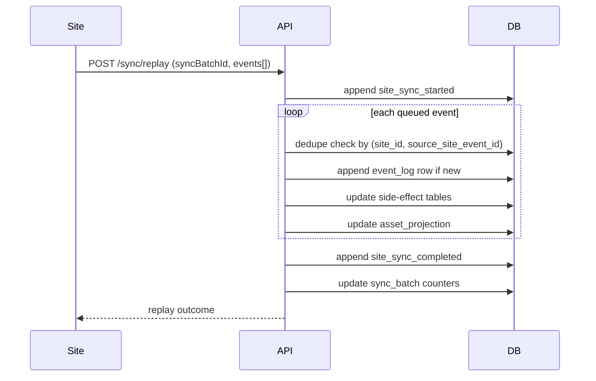

# Sync and Replay

## Operational Context

Sites can go offline and continue recording local events. When connection restores, queued events are replayed through a sync batch.

## Replay Flow

1. Site sends `/api/v1/sync/replay` with `siteId`, `syncBatchId`, and queued events.
2. API emits `site_sync_started`.
3. API ingests each queued event idempotently.
4. API emits `site_sync_completed` with accepted/rejected counts.
5. `sync_batch` and site sync timestamps are updated.

## Determinism

- Replay order is preserved by request list order.
- Duplicate source events are accepted as deduplicated results.
- Projection updates are sequence-aware.

## Lag Visibility

Site lag is surfaced by comparing `site.last_sync_completed_at` against configured staleness threshold (`SYNC_STALE_MINUTES`).

## Sequence Diagram

